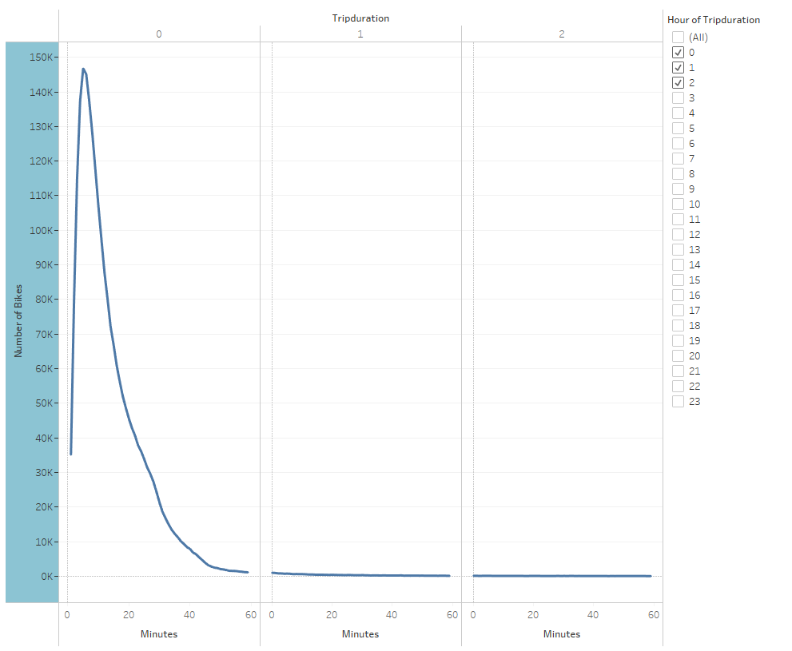
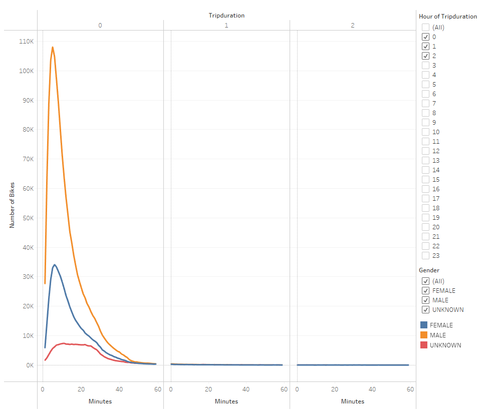
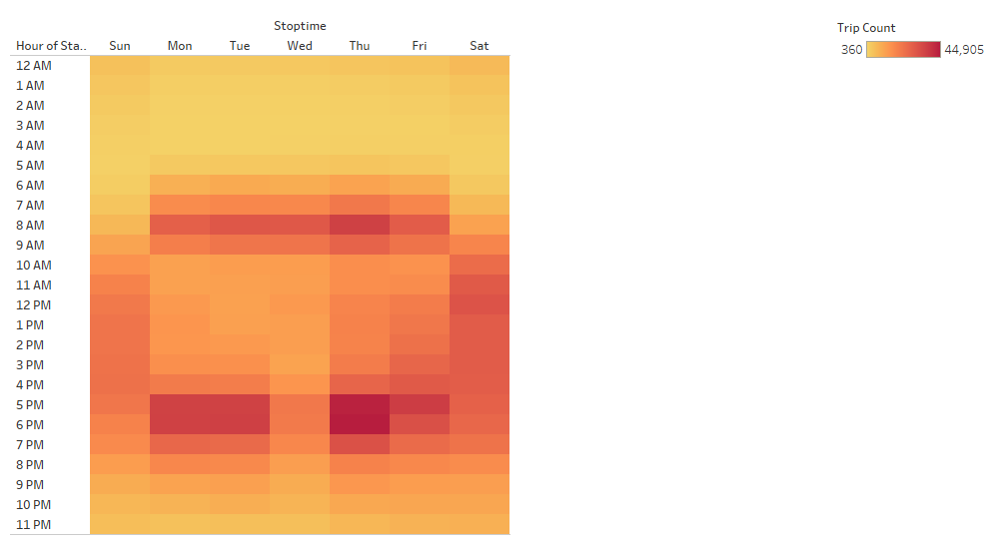
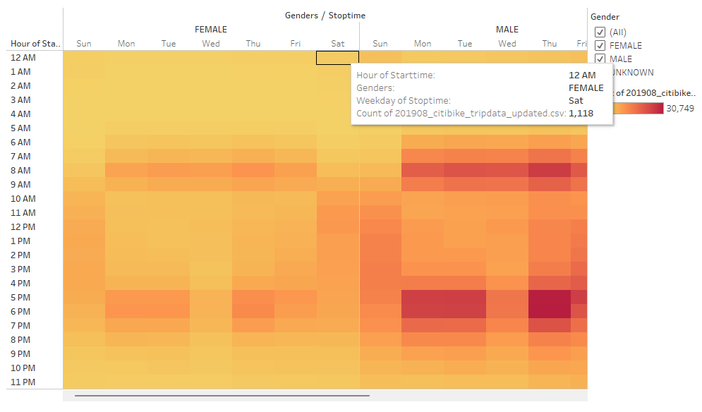
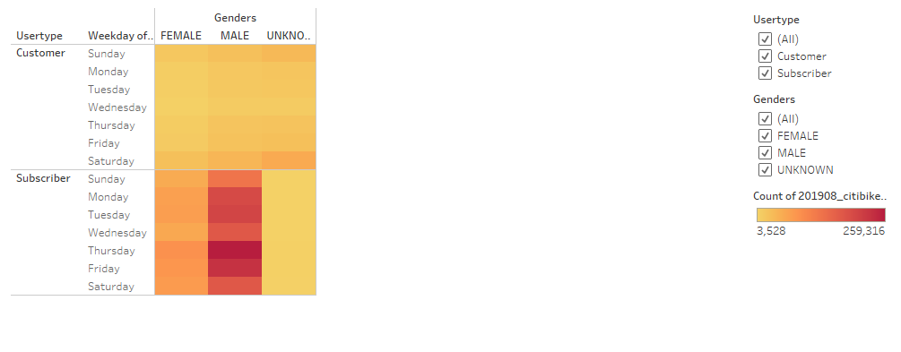
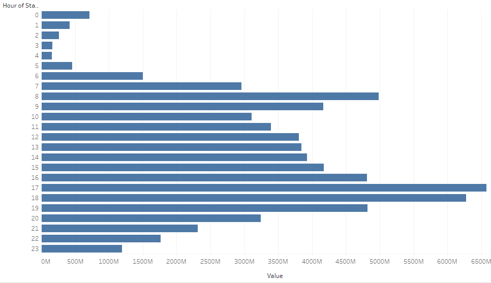
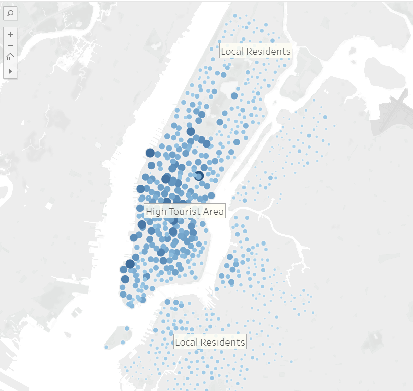
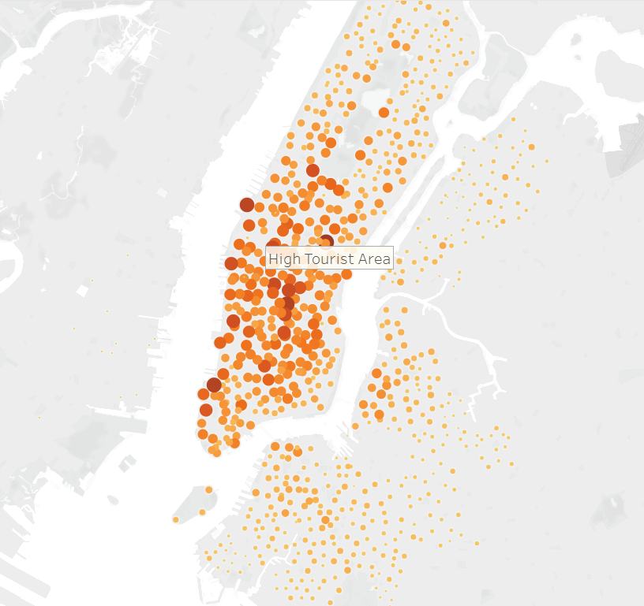

# bikesharing
Analyze NYC CitiBike bikesharing data from August 2019 with Tableau and create a clear visualization of the data

## Overview

[Tableau Story](https://public.tableau.com/app/profile/rachel.hollis/viz/NYCCitiBikeAnalysis_16449558913820/NYCCitiBikeAnalysis)

Using NYC CitiBike bikesharing data and data visualization tools, explore the data to help answer key questions investors might have when determining the success in starting a new bike share.

# Analysis 

### Breakdown of Customers

A significant number of users are Subscribers (just over 3/4). These subscribers make the most use of the bikes and are the main source of income. A marketing campaign to incentivize subscribing to the service while simultaneously making the service accesible to anyone would be the best course of action. For example: a user friendly app for one time users and providing special rates to subscribers. The bikeshare users are also predominantly male, at approximately 5/8.  

### Duration of Rides

### Duration of Rides Brokendown by Gender

### Trips per hour by Weekday

### Trips per hour by Weekeday, brokendown by Gender

### Trips per day brokendown by Gender

## Peak usage hours in August

## Top Starting Locations

### Top Ending Locations

Bike usage is exponentially higher in the known tourist areas of Manhattan. Supplying bikes around these areas is extremely important in keeping the service accessible. 
