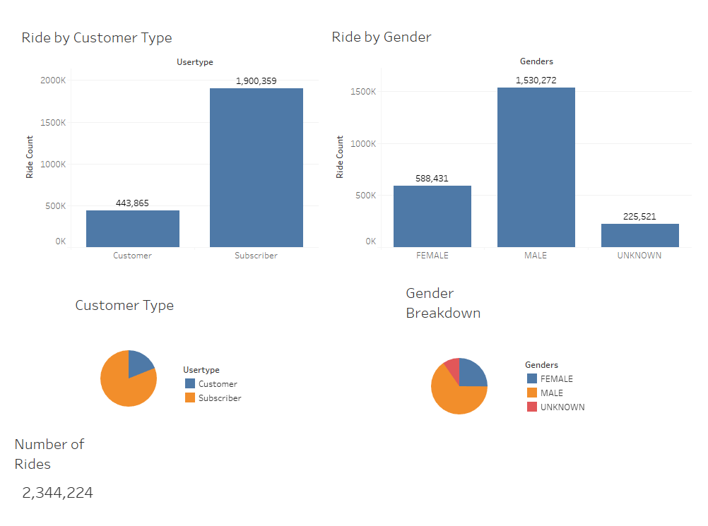

# bikesharing
Analyze NYC CitiBike bikesharing data from August 2019 with Tableau and create a clear visualization of the data

# Overview

[Tableau Story](https://public.tableau.com/app/profile/rachel.hollis/viz/NYCCitiBikeAnalysis_16449558913820/NYCCitiBikeAnalysis)

Using NYC CitiBike bikesharing data and data visualization tools, explore the data to help answer key questions investors might have when determining the success in starting a new bike share.

# Analysis 

## Breakdown of Customers

A significant number of users are Subscribers (just over 3/4). These subscribers make the most use of the bikes and are the main source of income. A marketing campaign to incentivize subscribing to the service while simultaneously making the service accesible to anyone would be the best course of action. For example: a user friendly app for one time users and providing special rates to subscribers. The bikeshare users are also predominantly male, at approximately 5/8.  

## Duration of Rides

As the data is filterd, it is clear that the average duration of bike trips are under an hour in length, with the vast majority being under 30 minutes. This could determine that it is unlikely that a city that is more spaced out will be as successful as the CitiBike usage in New York. 

## Duration of Rides Brokendown by Gender

This chart shows that not only are Male users more common, they also tend to have longer rides on the bikes. 

## Trips per hour by Weekday

The heatmap is used to show the weekly usage patterns. There is heavy bike usaged during weekday commute times. As well as an increase in bike usage during the day on Saturdays and Sundays. One imporant thing to note: the early more hours of the day have low usage every day of the week. This could be the optimal time to schedule bike maintenance. 

## Trips per hour by Weekeday, brokendown by Gender

Another breakdown by Gender. The usage appears to correlate in terms of time, however there is a significant increase in usaged from Male users rather than Female users. 

## Trips per day brokendown by Gender

This visualization shows the relationship between gender and usage by day. 

## Peak usage hours in August

This visualization shows that around 8 am and 6 pm usage increases. Having available working bikes is cruical around these times. 

## Top Starting Locations

## Top Ending Locations

Bike usage is exponentially higher in the known tourist areas of Manhattan. Supplying bikes around these areas is extremely important in keeping the service accessible. 

# Summary

In a busy, tourist heavy, metropolitain city, the bikeshare service is successful, even in one of the hottest months of the year. Further analysis on winter months would be beneficial in determining the success year long. However, the users are predominately male. While they are a reliable market, reaching potential female customers could be instrumental. 

Further analysis of the data that could produce a successful campaign:
- Analyze every month, not just August by:
  - comparing total usages by months
  - comparing duration by months
  - determine if school has an impact on usage
- Analyze usage by Age
